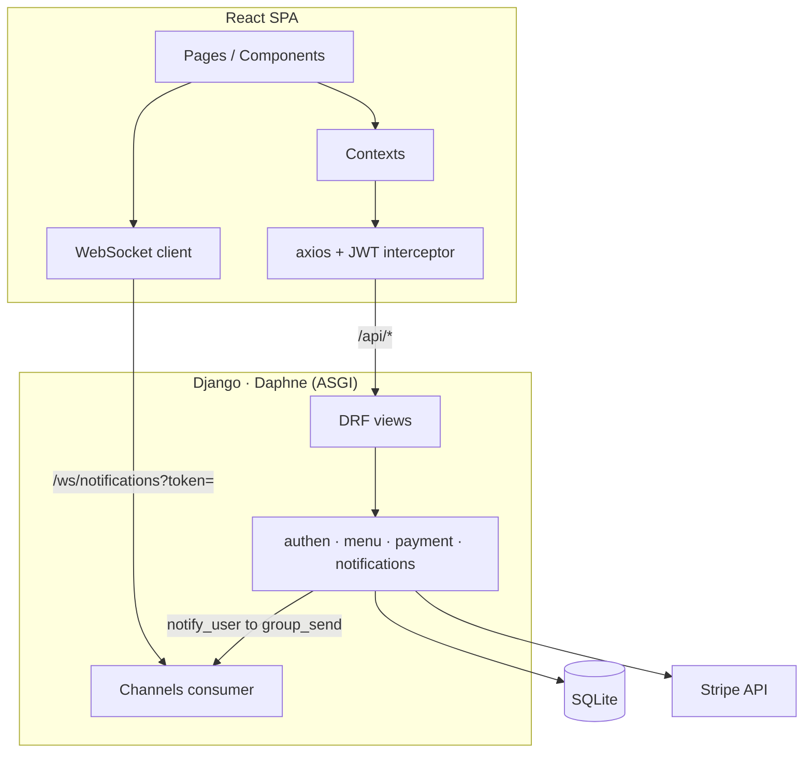
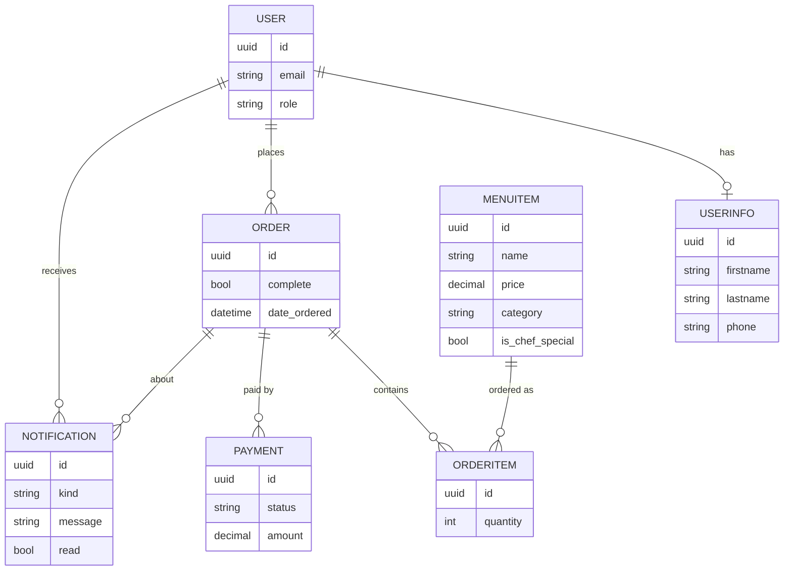
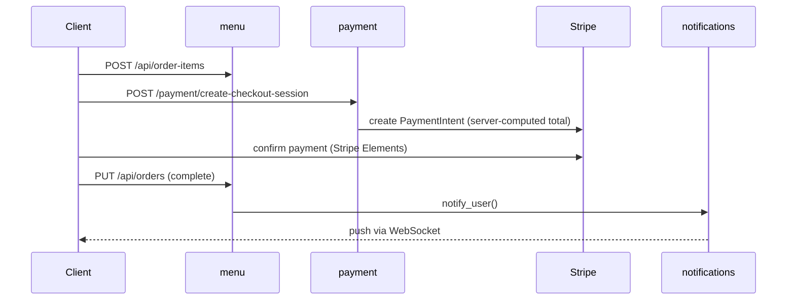
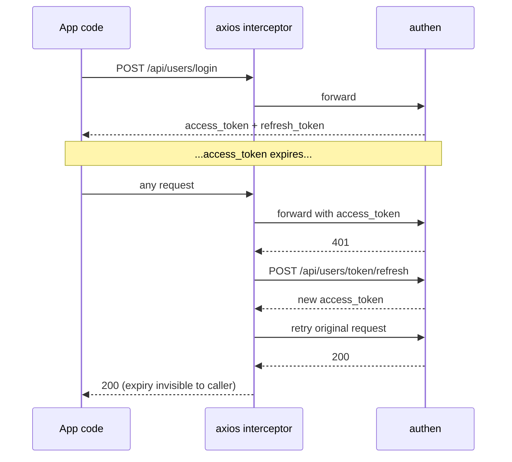

# Lumière

Fine-dining ordering platform. Django (DRF + Channels) backend, React SPA frontend, Stripe checkout, real-time notifications.

## Architecture



## Data Model



## Order Flow



## Auth Flow



## Quick Start

```bash
uv sync
cp .env.example .env
uv run python manage.py migrate
uv run python manage.py seed_menu
uv run python manage.py runserver

cd client
npm install
cp .env.example .env
npm run dev
```
